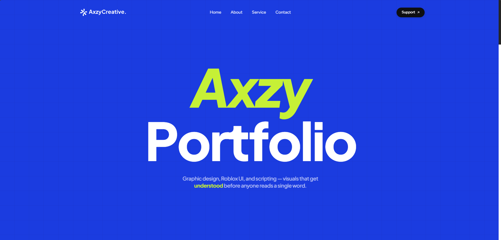
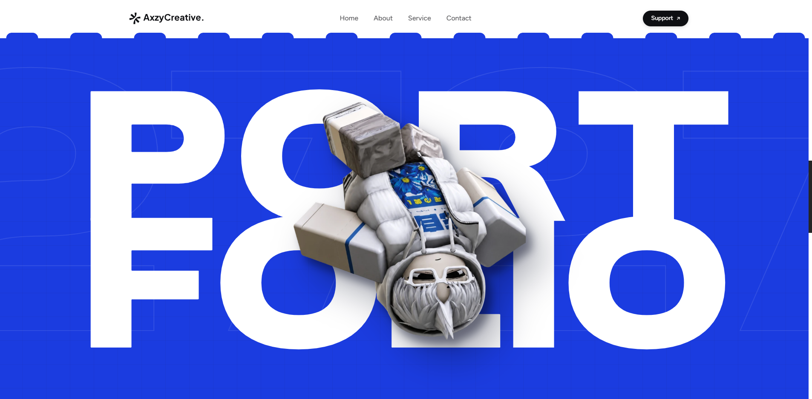
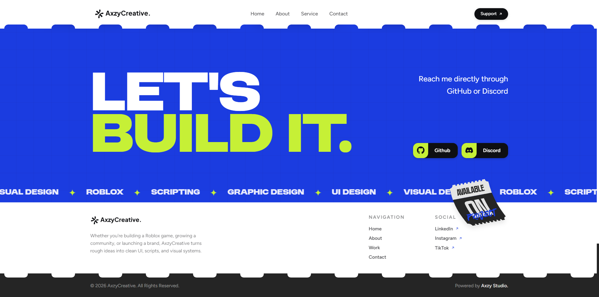

# AXZY Creative — Portfolio

Personal portfolio website for **Axzy** — graphic design, Roblox UI/UX, and Lua scripting.
Built as a single-page experience with heavy typography, layered parallax, and a retro-modern "ticket" aesthetic.

**Live sections:** Hero · About · Services · Portfolio · Rating · Testimonials · Contact

---

## Tech Stack

| Layer | Tool |
|---|---|
| Framework | [React 18](https://react.dev/) + [Vite 6](https://vitejs.dev/) |
| Styling | [Tailwind CSS v4](https://tailwindcss.com/) (`@theme` tokens) |
| Animation | [Motion (Framer Motion v11)](https://motion.dev/) |
| Scrolling | [SimpleBar](https://github.com/Grsmto/simplebar) + custom inertia smooth-scroll |
| Icons | Bootstrap Icons |
| Fonts | Figtree · Plus Jakarta Sans (Google Fonts) · Moderniz · Azonix (local) |

## Features

- **Per-letter staggered typography** — titles animate in letter by letter with blur and vertical motion.
- **Responsive title wrapping** — the PORTFOLIO title breaks into `PORT / FOLIO` on desktop and `POR / TFO / LIO` on mobile, with every line justified to the same width. Breakpoints are handled in CSS, so rotating a device re-flows correctly.
- **Inertia smooth scrolling** (desktop only) — wheel input is eased with a lerp loop that instantly yields to navbar clicks, keyboard, and scrollbar drags.
- **Scroll-linked parallax** — title, character, and background texture move at different speeds.
- **Ticket-tear edges** — navbar, footer, and section boundaries use SVG-masked notches for a torn-ticket look.
- **Anti-screenshot reveal** — content animates in only while it is inside the viewport and dissolves when scrolled past.
- **Draggable easter egg** — the "Available on Project" paper in the footer can be dragged and springs back.

## Getting Started

```bash
# install dependencies
npm install

# start the dev server
npm run dev

# production build (outputs to dist/)
npm run build

# preview the production build
npm run preview
```

## Project Structure

```
├── index.html              # meta/SEO tags, font loading, JSON-LD
├── public/                 # static assets (webp objects, SVGs, local fonts)
└── src/
    ├── App.jsx             # layout + SimpleBar scroll container
    ├── index.css           # theme tokens, utilities, tear masks
    ├── use-smooth-scroll.js# inertia wheel scrolling (desktop)
    ├── use-is-mobile.js    # matchMedia breakpoint hook
    ├── scroll-context.js   # shares the SimpleBar scroll element
    └── components/
        ├── Navbar.jsx      # fixed navbar, solid-on-scroll, mobile menu
        ├── Hero.jsx        # per-letter headline + parallax
        ├── AboutServices.jsx
        ├── Portfolio.jsx   # responsive split title + character
        ├── RatingTicket.jsx
        ├── Testimonials.jsx# dual-direction marquee rows
        ├── LetsBuildIt.jsx # contact CTA + skill marquee
        └── Footer.jsx
```

## Preview







---

© 2026 AxzyCreative. All rights reserved.
